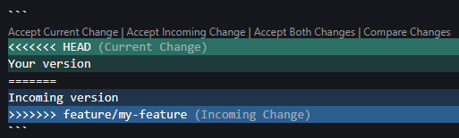
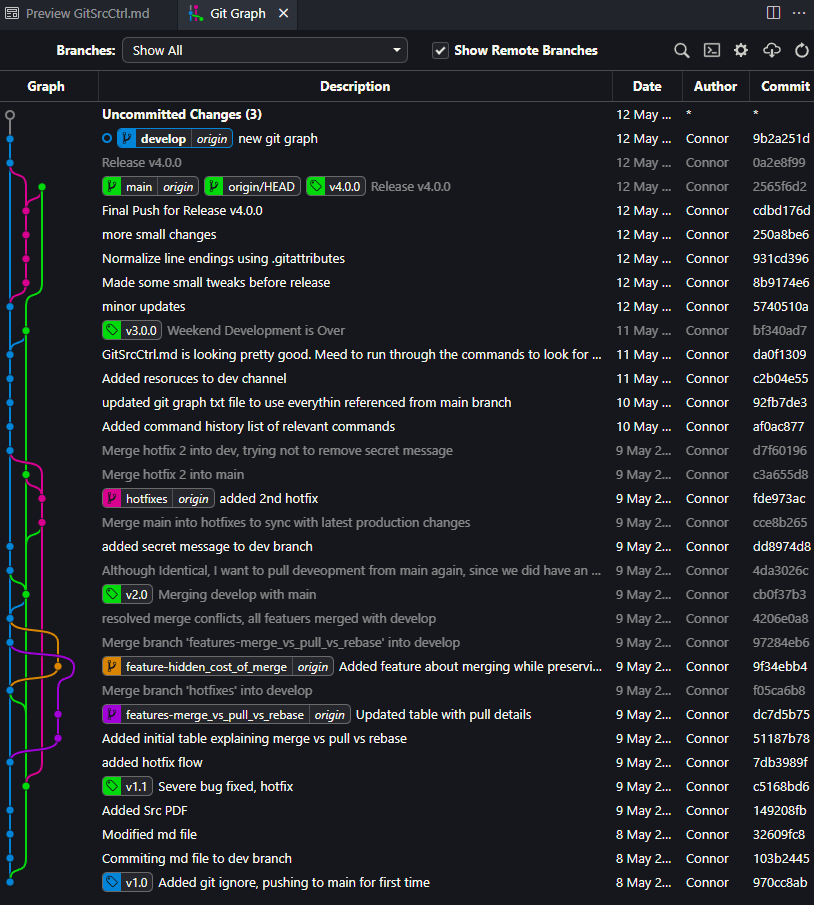

# Git Source Control

## 📚 Table of Contents

* [🧭 Project Overview](#-project-overview)
* [📁 Branch Structure Summary](#-branch-structure-summary)
* [⚙️ Git Configuration](#️-git-configuration-recommended-for-team)
* [🛠️ Core Workflow Commands](#️-core-workflow-commands-fully-explained)
* [⚔️ Handling Merge Conflicts in VS Code](#️-handling-merge-conflicts-in-vs-code)
* [🔁 Reverting a Pushed Commit (Safe Method)](#-reverting-a-pushed-commit-safe-method)
* [🔀 Merge vs Pull vs Rebase Summary](#-merge-vs-pull-vs-rebase-summary)
* [🧾 List All Branches in a Git Repository](#-list-all-branches-in-a-git-repository)
* [📊 Visualizing Git History](#-visualizing-git-history)
* [🧠 Best Practices & Lessons Learned](#-best-practices--lessons-learned)
* [🧪 Practice Resources](#-practice-resources)
* [📌 Reference Materials](#-reference-materials)

## 🧭 Project Overview

This project documents a full hands-on implementation of Git Flow, based on the article [A Successful Git Branching Model](https://nvie.com/posts/a-successful-git-branching-model/). It is designed as a comprehensive guide and training resource for engineers and developers with little to no Git experience.

The objective is to teach:

* How to use version control for collaborative development
* How to organize work using `main`, `develop`, `feature`, `release`, and `hotfix` branches
* How to manage merges, rebase, tagging, and upstream tracking
* How to resolve merge conflicts and preserve project history

---

## 📁 Branch Structure Summary

Following Git Flow:
* `main` → Stable, production-ready code (only updated from `release/*` or `hotfix/*`)
* `develop` → Integration branch for all features
* `feature/*` → Short-lived branches for individual features (e.g., `feature/login-ui`)
* `release/*` → Pre-release stabilization branches (e.g., `release/<version>`)
* `hotfix/*` → Emergency fixes branched from `main` (e.g., `hotfix/<verison>`)

Tags like `v1.0.0`, `v1.1.0`, and `v<version>` mark official release points.

> 📝 **Note:** Each feature should be developed in a **separate branch** from `develop`. Feature branches follow the naming convention `feature/*`, where `*` is a brief, dash-separated description (e.g., `feature/export-csv`).


---

## ⚙️ Git Configuration (Recommended for Team)

### SSH Tag Signing Setup

```bash
git config --global gpg.format ssh # Use SSH key for tag signing
```

```bash
git config --global user.signingkey ~/.ssh/id_ed25519.pub # Sets your public key for tag signing
```

### Automatically Set Upstream for New Branches

```bash
git config --global push.autoSetupRemote true # Auto-sets upstream when pushing new branches
```

### Git Line Ending Configuration (Cross-Platform)

**Add this `.gitattributes` file:**

```bash
# Use LF (Unix-style) endings for source code
*.c     text eol=lf
*.cpp   text eol=lf
*.h     text eol=lf
*.py    text eol=lf
*.sh    text eol=lf
*.md    text eol=lf
*.txt   text eol=lf

# Treat .git* files as text with LF
.gitignore text eol=lf
.gitattributes text eol=lf

# Use CRLF for Windows batch files (optional, for compatibility)
*.bat   text eol=crlf

# Prevent Git from touching line endings for binary files
*.jpg   binary
*.jpeg  binary
*.png   binary
*.gif   binary
*.pdf   binary
*.zip   binary
*.exe   binary
```

```bash
git add --renormalize . # Applies .gitattributes settings retroactively
```

```bash
git commit -m "Normalize line endings using .gitattributes" # Commits normalized line endings
```

---

## 🛠️ Core Workflow Commands (Fully Explained)

### Create Tag

```bash
git tag -sa v1.0.0 -m "Initial Version Release" # Creates a signed annotated tag
```

```bash
git tag -sa v<version> -m "Release Description" # Template for future tags
```

### Create `develop` From `main`

```bash
git checkout main # Switches to main branch
```

```bash
git pull origin main # Syncs with remote main branch
```

```bash
git checkout -b develop # Creates and switches to new develop branch
```

```bash
git push -u origin develop # Pushes develop and sets upstream
```

### Create a Feature Branch

```bash
git checkout develop # Switch to develop
```

```bash
git pull origin develop # Ensure it’s up-to-date
```

```bash
git checkout -b feature/my-feature # Create and switch to feature branch
```

### Maintain a Feature Branch

```bash
git add . # Stage all modified and new files
```

```bash
git commit -m "<your message>" # Commit your changes
```

```bash
git push # Push changes to remote feature branch
```

### Merge a Feature into `develop`

```bash
git checkout develop # Switch to develop
```

```bash
git pull origin develop # Update with latest changes
```

```bash
git merge --no-ff feature/my-feature -m "Merge feature/my-feature" # Merge feature preserving history
```

```bash
git push # Pushes merged changes
```

### Start a Release Branch

```bash
git checkout develop # Start from develop
```

```bash
git pull origin develop # Update local develop
```

```bash
git checkout -b release/<version> # Create and switch to release branch
```

### Maintain a Release Branch
```bash
git add . # Stage all modified and new files
```

```bash
git commit -m "<your message>" # Commit your changes
```

```bash
git push # Push changes to remote release branch
```

### Finish the Release

```bash
git checkout main # Switch to main for final release merge
```

```bash
git merge --no-ff release/<version> -m "Release v<version>" # Merge release into main with history
```

```bash
git tag -sa v<version> -m "Tagging release v<version>" # Create signed tag
```

```bash
git push # Push main branch updates
```

```bash
git push origin v<version> # Push tag to remote
```

```bash
git checkout develop # Switch to develop
```

```bash
git merge --no-ff release/<version> -m "Merge release v<version>" # Merge release back to develop
```

```bash
git push # Push develop with merged release
```

```bash
git branch -d release/<version> # Delete local release branch
```

```bash
git push origin --delete release/<version> # Delete remote release branch
```

### Creating a Hotfix Branch

```bash
git checkout main # Switch to main
```

```bash
git pull origin main # Sync latest main
```

```bash
git checkout -b hotfix/<version> # Create hotfix branch
```

### Maintain a Hotfix Branch

```bash
git add . # Stage all modified and new files
```

```bash
git commit -m "<your message>" # Commit your changes
```

```bash
git push # Push changes to remote hotfix branch
```

### Merge Hotfix into `main`, Tag It

```bash
git checkout main # Switch to main
```

```bash
git merge --no-ff hotfix/<verison> -m "Apply hotfix v<verison>" # Merge hotfix into main
```

```bash
git tag -sa v<verison> -m "Hotfix v<verison>" # Tag hotfix version
```

```bash
git push # Push hotfix to remote
```

```bash
git push origin v<verison> # Push hotfix tag
```

### Merge Hotfix into `develop`

```bash
git checkout develop # Switch to develop
```

```bash
git pull origin develop # Update local develop
```

```bash
git merge --no-ff hotfix/<verison> -m "Backport hotfix v<verison>" # Merge hotfix into develop
```

```bash
git push # Push changes
```

### Clean Up Hotfix

```bash
git branch -d hotfix/<verison> # Delete local hotfix branch
```

```bash
git push origin --delete hotfix/<verison> # Delete remote hotfix branch
```

### Syncing Hotfix with Latest Main Code

```bash
git checkout hotfix/<verison> # Switch to hotfix
```

```bash
git fetch origin # Get latest remote changes
```

```bash
git merge origin/main --no-ff -m "Sync hotfix with main" # Merge main into hotfix
```

```bash
git push # Push updated hotfix
```


---

## ⚔️ Handling Merge Conflicts in VS Code

1. Start the merge:

```bash
git merge feature/my-feature # Attempt to merge feature
```

2. VS Code highlights conflicted files
3. Open files to resolve blocks:



4. Use the resolution buttons provided in the editor:
    - **Accept Current Change** – Keeps the version from your current branch (`HEAD`).
    - **Accept Incoming Change** – Uses the version from the branch you're merging in.
    - **Accept Both Changes** – Keeps both versions, stacked one after the other.
    - **Compare Changes** – Opens a side-by-side diff view to help you decide.

5. Save and stage the resolved file:
    ```bash
    git add . # Stage resolved files
    ```

6. Commit the merge:
    ```bash
    git commit -m "Resolve merge conflict" # Finalize merge
    ```

7. Push the result to remote repository:
    ```bash
    git push
    ```
---
## 🔁 Reverting a Pushed Commit (Safe Method)

If you’ve already pushed to the remote and others may have pulled it, the safest way to undo changes is by **reverting** the commit:

```bash
git revert <commit-hash>
git push
```

This creates a new commit that undoes the changes without modifying the existing history — ideal for shared branches.

---

## 🔀 Merge vs Pull vs Rebase Summary

| Command  | What It Does                                          | When to Use                                     |
| -------- | ----------------------------------------------------- | ----------------------------------------------- |
| `merge`  | Combines branches with a merge commit                 | Always use for features, releases, and hotfixes |
| `pull`   | Shortcut for fetch + merge of current upstream branch | Keep local branch up to date                    |
| `rebase` | Rewrites commits onto a new base (linear history)     | Use only on local/private feature branches      |

---
## 🧾 List All Branches in a Git Repository

To view all local branches:
```bash
git branch
```

To view all remote branches:
```bash
git branch -r
```

To view both local and remote branches:
```bash
git branch -a
```

To see branches with their last commit info:
```bash
git branch -vv
```

---

## 📊 Visualizing Git History

```bash
git log --oneline --graph --all --decorate # Pretty git history visualization
```

```bash
git log --oneline --graph --all --decorate > git_graph.txt # Save history view to file
```
---

## 🔍 Git Graph (VS Code Extension)

The **Git Graph** extension for VS Code provides a powerful visual interface to explore your Git repository’s history. It displays branches, merges, tags, and commit messages in a clean, interactive format.

This graph helps validate whether Git Flow conventions—like release merges, tag placement, and hotfix branching—have been followed correctly.



### ✅ Key Git Flow Confirmations:
- `release/4.0.0` was created and used for staging commits (e.g., "Final Push for Release v4.0.0").
- The release was merged into `main` and **tagged `v4.0.0`**, as required.
- It was then merged back into `develop`, completing the release cycle.
- The branch reference for `release/4.0.0` is deleted, but its history is preserved via merges.
- Multiple hotfixes exist and are visible with tags (`v1.1`, `v2.0`) and a dedicated `hotfixes` branch.

### ⚠️ Issues to Note:
- **Hotfix Divergence**: 
  The second hotfix (`added 2nd hotfix`) exists on the `hotfixes` branch and was merged into `main`, but **was not merged back into `develop`**.
  - This breaks the Git Flow model, which requires hotfixes to be merged into both `main` and `develop` to prevent regressions.
  - Consider creating a merge commit from `hotfixes` into `develop` to synchronize branches.

---

### Recommendation:
Regularly use Git Graph or `git log --oneline --graph --all --decorate` to audit your branching and merging practices. This ensures alignment with Git Flow and avoids lost fixes or duplicate work.

---

## 🧠 Best Practices & Lessons Learned

* Use `--no-ff` to preserve branch history
* One feature per `feature/*` branch from `develop`
* Create `release/*` for each version
* Hotfix from `main`, merge into `main` and `develop`
* Tag releases **after** merging into `main`
* Clean up merged branches
* Avoid rebase on shared branches

---

## 🧪 Practice Resources

* Simulate merge conflicts
* Try reverting a merge commit:

```bash
git revert -m 1 <merge-commit> # Reverts a specific merge
```

* Use `git stash` for managing WIP
* Use reflog to recover deleted branches

---

## 📌 Reference Materials

* [A successful Git branching model](https://nvie.com/posts/a-successful-git-branching-model/)
* `cmd_hist`: full command history
* `git_graph.txt`: visual history output
* This document: internal Git Flow tutorial
