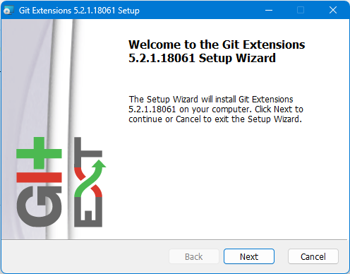
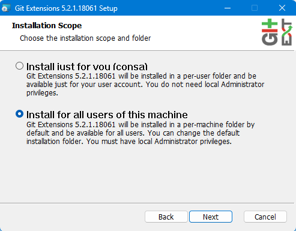
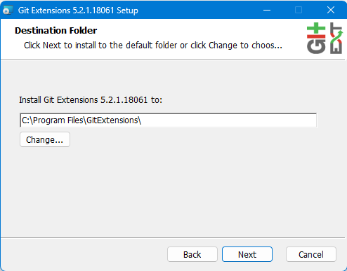
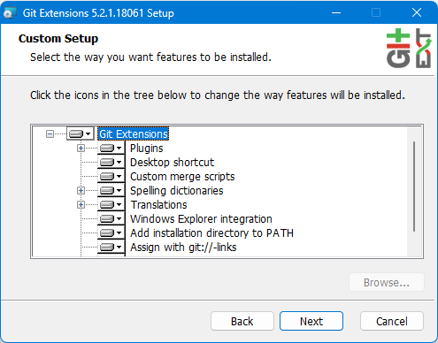
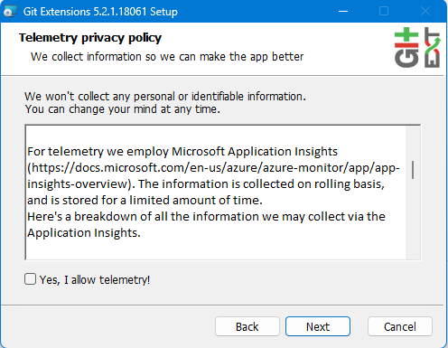
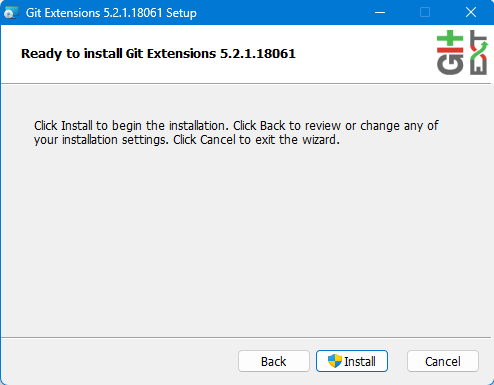
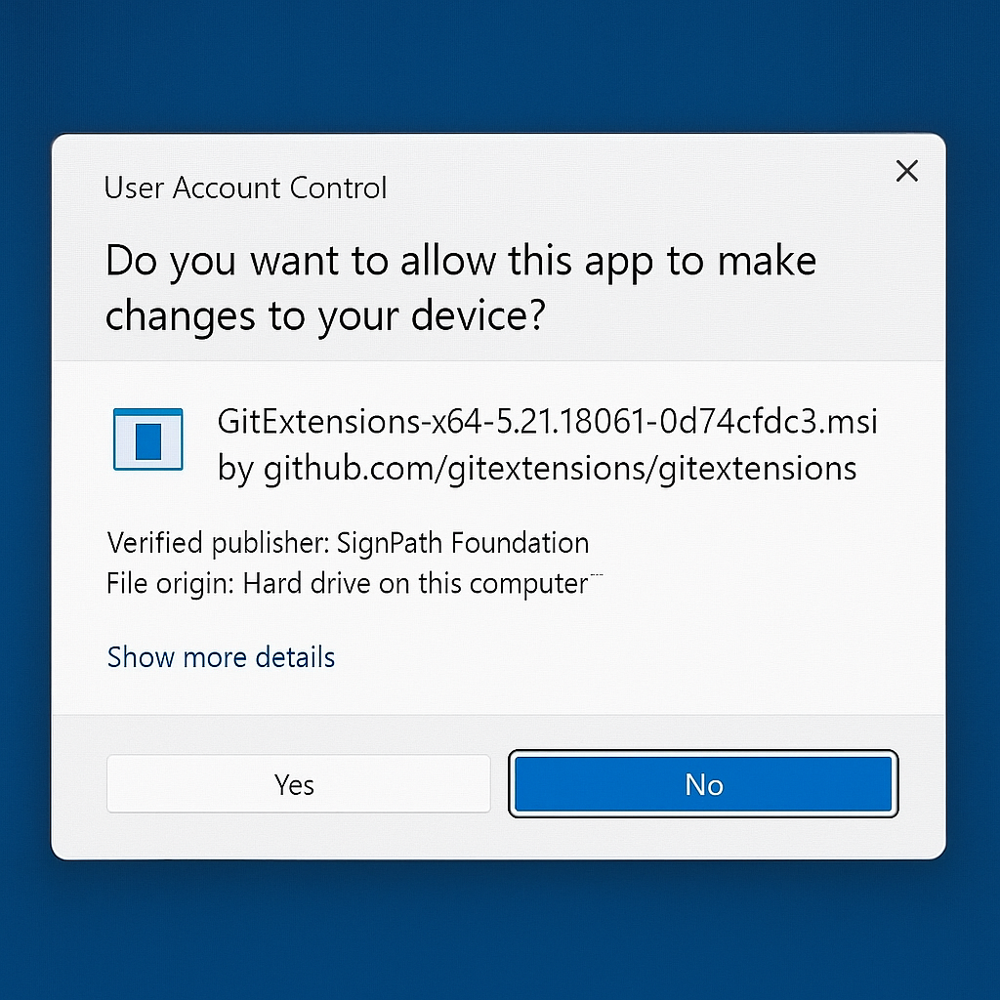
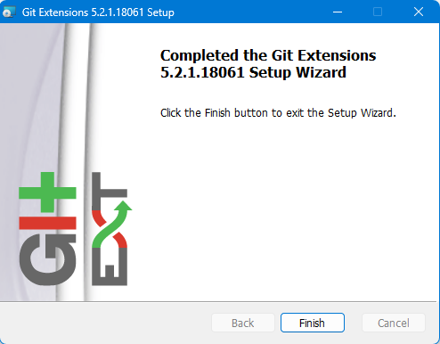

# GitLab Setup for Windows <br> (Using Git Extensions & HTTPS)

## 📚 Table of Contents

1. [Applications Overview](#applications-overview)
2. [Installing Git Extensions](#installing-git-extensions)
3. [Installing and Configuring VS Code](#installing-and-configuring-vs-code)
4. [Initial Git Configuration](#initial-git-configuration)
5. [GitLab HTTPS Authentication Setup](#gitlab-https-authentication-setup)
6. [Cloning a GitLab Repo](#cloning-a-gitlab-repo)
7. [Using Git Extensions (Common Tasks)](#using-git-extensions-common-tasks)
8. [Fix-Specific Troubleshooting](#fix-specific-troubleshooting)
9. [Advanced Git Knowledge](#advanced-git-knowledge)
10. [Resources & References](#resources--references)

---

## 🧩 Applications Overview

| Application            | Purpose                                    |
| ---------------------- | ------------------------------------------ |
| Git for Windows        | Backend Git system                         |
| Git Extensions         | Graphical Git UI                           |
| VS Code                | Code editing + Git integration             |
| Git Credential Manager | Secure token handling (installed with Git) |
| Optional Tools         | Meld/KDiff3 for diff/merge support         |

---

## 🧰 Installing Git Extensions
### Download Files
1. Go to [gitextensions.github.io](https://gitextensions.github.io/) to download Git Extensions.

2. Click on the blue `Download` button <br> 

3. Scroll down the GitHub Releases page to find `Assets` section. Only download the `GitExtensions-x64-<Version>.msi` file. In the screenshot below, the name of the file we want is `GitExtensions-x64-5.2.1.18061-0d74cfdc3.msi`, but this will change as new versions are released. <br> 

### Install with defaults (includes Git for Windows)

4. Click `Next` button <br> 


5. Ensure `Install for all users of this machine` is selected. Then, click `Next` button <br> 


6. Click `Next` button, unless you have a very good reason to install the application somewhere else. As this is the default path, this is likely to be where companion applications will look for Git Extensions to be installed. If you decide to install it elsewhere, take note of where you install it. <br> 

7. Click `Next` button <br> 

8. Deselect Checkbox to disable telemetry. <br> 

9. a. Click `Install` <br> 

9. b. The action above requires administrator access. If you are not the administrator of your machine, you will have to get administrator approval. Typically, this means an admin will have to enter their credentials into a prompt that appears.

10. Click `Yes` if any confirmation prompts appear. Here is a sample of the one I received. <br> 

11. If the installation was successful, you should see this message. Click `Finish`. <br> 
---

## 🧰 Installing and Configuring VS Code

1. Download from [https://code.visualstudio.com](https://code.visualstudio.com)

2. Install with defaults

3. Launch and go to `Extensions (Ctrl+Shift+X)` → Search and install:

   * **GitLab Workflow**
   * **Git Graph**
   * **GitLens**

4. Set Git as the source control provider:

   * Open Command Palette → `Git: Show Git Output` to verify
   * Make a test repo and check for Git integration in the Source Control tab

**🖼️ Image Placeholder:** `images/vscode-git-tab.png`

> *Screenshot: VS Code showing Source Control with Git initialized.*

---

## ⚙️ Initial Git Configuration

1. Open Git Extensions → `Tools > Settings > Git Config`
2. Set:

   * User Name: `Your Name`
   * Email: `your_email@example.com`

**🖼️ Image Placeholder:** `images/git-config-extensions.png`

---

## 🔐 GitLab HTTPS Authentication Setup

1. Go to GitLab → `User Icon > Preferences > Access Tokens`
2. Create a new **Personal Access Token**:

   * Name: `VSCode or GitExtensions`
   * Expiration: Optional
   * Scopes: `read_repository`, `write_repository`
3. Copy the token (you won't be able to view it again!)
4. Open Git Extensions and perform a push or pull

   * When prompted, use:

     * **Username**: your GitLab username
     * **Password**: your personal access token

**🖼️ Image Placeholder:** `images/gitlab-token-page.png`

> *Screenshot: GitLab token creation page with scopes selected.*

**🖼️ Image Placeholder:** `images/gitextensions-auth-popup.png`

> *Screenshot: Git Extensions authentication prompt.*

**💡 Notes**

* First time you push, Git Credential Manager will save your token.
* You can view/edit saved credentials in **Windows Credential Manager**.

---

## 📥 Cloning a GitLab Repo

1. Copy the HTTPS clone URL from your GitLab project
2. Open Git Extensions → `Clone repository`
3. Paste the URL and choose destination folder
4. Click `Clone`

**🖼️ Image Placeholder:** `images/gitextensions-clone-window.png`

---

## 🛠️ Using Git Extensions (Common Tasks)

### Committing

* Make changes
* Go to `Commit` tab
* Stage files and write commit message

**🖼️ Placeholder:** `images/gitextensions-commit-window.png`

### Pulling & Pushing

* Use top buttons: `Pull`, `Push`
* Authentication will occur as needed

**🖼️ Placeholder:** `images/gitextensions-toolbar-push-pull.png`

---

## ❗ Fix-Specific Troubleshooting

| Problem                         | Fix                                                                                                                  |
| ------------------------------- | -------------------------------------------------------------------------------------------------------------------- |
| `Authentication Failed`         | Use your GitLab username and **token** as password. Clear saved credentials in Windows Credential Manager and retry. |
| `Repository Not Found`          | Double-check HTTPS URL. Ensure the repo exists and you have access.                                                  |
| `SSL Certificate Error`         | Ensure system time is accurate. Reinstall Git with updated CA certs.                                                 |
| `Git Not Recognized in VS Code` | Ensure Git is in your system PATH. Reinstall Git and restart VS Code.                                                |

---

## 🧹 Advanced Git Knowledge

### Understanding Loose Git Objects and `git gc`

<details>
<summary>Click to expand</summary>

<!-- DRAFT BEGIN -->
<!-- This is a random thing Chat explained to me earlier. It'll be useful evenually, but there's no good way to tie it in currently. -->
### Understanding Loose Git Objects and `git gc`

When working with Git, it's normal for the repository to accumulate **loose objects** over time. Here's what that means and how to handle it safely.

#### 🔍 What are Loose Objects?

- Git stores your project data (commits, files, trees) as **objects**.
- These objects can be stored in two ways:
  - **Loose Objects**: Individual files (one per object)
  - **Packed Objects**: Multiple objects grouped and compressed into a single file

Loose objects are created during normal Git operations such as:

- Running `git add`, `git commit`
- Performing merges, rebases, or stashes
- Making frequent small changes

Over time, having thousands of loose objects can slow down your Git operations.

#### ⚠️ Why This Message Appears

If you see:

> "This repository currently has approximately 5246 loose objects... To maintain optimal performance it is strongly recommended that you compress the database."

It means Git is suggesting you clean up and compress these objects to improve performance.

#### 🧹 What Does `git gc` Do?

Running `git gc` (short for "garbage collection"):

- Compresses loose objects into more efficient **packfiles**
- Cleans up unnecessary or unreachable objects
- Reduces disk usage
- Improves Git performance

#### ✅ Is It Safe?

Yes, running `git gc` is **safe** and **recommended**. It will **not delete your files** or lose your commits, as long as they are still reachable (e.g., referenced by branches or tags).

> 💡 If you're unsure, you can create a backup or clone the repository before running the command.

#### 🛠️ To Run the Cleanup

Open your terminal in the repo and run:

```bash
git gc
```

That's it! Your repository will be optimized and ready to go.
<!-- DRAFT END -->

</details>

---

## 📚 Resources & References

* [GitLab Docs](https://docs.gitlab.com)
* [Git Extensions Wiki](https://github.com/gitextensions/gitextensions/wiki)
* [VS Code GitLab Extension](https://marketplace.visualstudio.com/items?itemName=GitLab.gitlab-workflow)
* [Git Credential Manager](https://github.com/git-ecosystem/git-credential-manager)

---

Let me know if you'd like:

* Actual mockup images to be generated
* A PDF version exported
* Syntax highlighting for code-specific workflows in VS Code
* Additional section for merge conflicts (GUI only)
