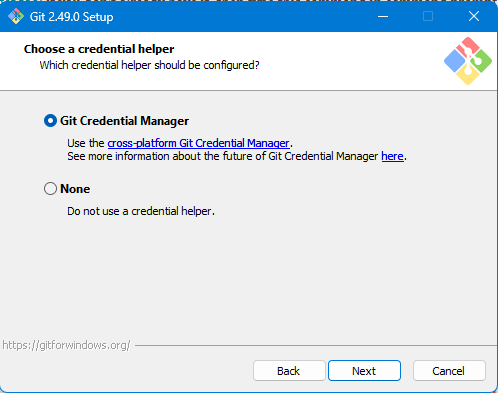

# GitLab Setup for Windows <br> (Using Git Extensions & HTTPS)

## 📚 Table of Contents

1. [Applications Overview](#applications-overview)
2. [Installing Git for Windows](#installing-git-for-windows)
3. [Installing Git Extensions](#installing-git-extensions)
4. [Installing and Configuring VS Code](#installing-and-configuring-vs-code)
5. [Initial Git Configuration](#initial-git-configuration)
6. [GitLab HTTPS Authentication Setup](#gitlab-https-authentication-setup)
7. [Cloning a GitLab Repo](#cloning-a-gitlab-repo)
8. [Using Git Extensions (Common Tasks)](#using-git-extensions-common-tasks)
9. [Fix-Specific Troubleshooting](#fix-specific-troubleshooting)
10. [Advanced Git Knowledge](#advanced-git-knowledge)
11. [Resources & References](#resources--references)

---

## 🧹 Applications Overview

| Application            | Purpose                                    |
| ---------------------- | ------------------------------------------ |
| Git for Windows        | Backend Git system                         |
| Git Extensions         | Graphical Git UI                           |
| VS Code                | Code editing + Git integration             |
| Git Credential Manager | Secure token handling (installed with Git) |
| Optional Tools         | Meld/KDiff3 for diff/merge support         |

---

## 🧰 Installing Git for Windows

**Step 1:** Go to [git-scm.com](https://git-scm.com/downloads/win) and download the latest Windows installer by clicking `Click here to download`. <br> 

**Step 2:** Double-click the downloaded `.exe` file to launch the setup wizard.

**Step 3:** Follow Installation Steps (Recommended Defaults):

* **a.** Click `Yes` if a **User Account Control** prompt appears. 
    * Note: This action may require administrator access. If you are not the administrator of your machine, you will have to get administrator approval. Typically, this means an admin will have to enter their credentials into a prompt that appears. <br> 

* **b.** Click `Next`. <br> 

* **c.** Accept default install path or specify a location. Click `Next` to proceed.
    * If you do not use the default path, other applications may struggle to locate Git Extensions. Record the custom path to configure companion applications in the future. <br> 

* **d.** Select the following Components. Click `Next` when done. <br> 

* **e.** Click `Next` to continue. <br> 

* **f.** Choose Visual Studio Code as your preferred editor. <br> 

* **g.** Select `Override the default branch name for new repositories` and ensure the specified name is `main`. Click `Next` to continue. <br> 

* **h.** Select `Git from the command line and also from 3rd-party software` the click `Next`. <br>  

* **i.** Select `Use bundled OpenSSH` and click `Next`. <br> 

* **j.** Select `Use the native Windows Secure Channel library` and click `Next`. <br> 

* **k.** Select `Checkout Windows-style, commit Unix-style line endings`. This helps ensure compatibility across both Windows and Unix Based Systems. Click `Next` to continue. <br> 

* **l.** Select `Use MinTTY (the default terminal of MSYS2)`. Click `Next` to continue. <br> 

* **m.** Select `Fast-forward or merge`. Click `Next` to continue. <br> 

* **n.** Select `Git Credential Manager`. Click `Next` to continue. <br> 

* **o.** Ensure both `Enable file system caching` and `Enable symbolic links` is selected. Click `Next` to continue. <br> 

* **p.** When installation is complete, click `Finish`. <br> 

**Step 4:** Confirm Installation

Run this in Command Prompt or PowerShell:

```bash
git --version
```

You should see something like `git version 2.xx.x.windows.x`

> TODO: Ensure Users know how to access command prompt

---

## 🧰 Installing Git Extensions

**Step 1:** Go to [gitextensions.github.io](https://gitextensions.github.io/) to download Git Extensions.

**Step 2:** Click the blue `Download` button. <br> 

**Step 3:** On the GitHub Releases page, download only the `GitExtensions-x64-<Version>.msi` file. <br> 

**Step 4:** Begin installation:

* **a.** Click `Next`. <br> 
* **b.** Select `Install for all users`. Click `Next`. <br> 
* **c.** Accept default install path or specify a location. Click `Next` to proceed.
    * If you do not use the default path, other applications may struggle to locate Git Extensions. Record the custom path to configure companion applications in the future.  <br> 
* **d.** Click `Next`. <br> 
* **e.** Deselect telemetry if preferred. <br> 

**Step 5:**

* **a.** Click `Install`. <br> 

* **b.** Click `Yes` if a **User Account Control** prompt appears. 
    * Note: This action may require administrator access. If you are not the administrator of your machine, you will have to get administrator approval. Typically, this means an admin will have to enter their credentials into a prompt that appears. <br> 

**Step 6:** When installation is complete click `Finish`. <br> 

---

## 🧰 Installing and Configuring VS Code

**Step 1:** Download from [https://code.visualstudio.com](https://code.visualstudio.com)

**Step 2:** Install with default options.

**Step 3:** Open VS Code and go to `Extensions (Ctrl+Shift+X)` → Search and install:

<!-- * GitLab Workflow -->

* Git Graph v3

**Step 4:** Set Git as the source control provider:

* Open Command Palette → `Git: Show Git Output`
* Create a test repo and verify Git integration

**🖼️ Image Placeholder:** `images/vscode-git-tab.png`

> *Screenshot: VS Code showing Source Control with Git initialized.*

---

## ⚙️ Initial Git Configuration

**Step 1:** Open Git Extensions → `Tools > Settings > Git Config`

**Step 2:** Set your identity:

* User Name: `Your Name`
* Email: `your_email@example.com`

**🖼️ Image Placeholder:** `images/git-config-extensions.png`

---

## 🔐 GitLab HTTPS Authentication Setup

**Step 1:** Go to GitLab → `User Icon > Preferences > Access Tokens`

**Step 2:** Create a token with:

* Name: `VSCode or GitExtensions`
* Scopes: `read_repository`, `write_repository`
* Optional: Set expiration date

**Step 3:** Copy the token (you won't see it again).

**Step 4:** Try to push/pull in Git Extensions → enter credentials:

* Username = GitLab username
* Password = personal access token

**🖼️ Image Placeholder:** `images/gitlab-token-page.png`

> *Screenshot: GitLab token creation page.*

**🖼️ Image Placeholder:** `images/gitextensions-auth-popup.png`

> *Screenshot: Git Extensions authentication prompt.*

💡 Git Credential Manager stores your token securely. Use **Windows Credential Manager** to manage saved logins.

---

## 📅 Cloning a GitLab Repo

**Step 1:** Copy HTTPS clone URL from GitLab

**Step 2:** In Git Extensions → Click `Clone repository`

**Step 3:** Paste URL and choose destination

**Step 4:** Click `Clone`

**🖼️ Image Placeholder:** `images/gitextensions-clone-window.png`

---

## 🛠️ Using Git Extensions (Common Tasks)

### Committing

* Edit files
* Go to `Commit` tab
* Stage and commit changes

**🖼️ Placeholder:** `images/gitextensions-commit-window.png`

### Pulling & Pushing

* Use toolbar buttons: `Pull`, `Push`
* Auth will use saved token or prompt if needed

**🖼️ Placeholder:** `images/gitextensions-toolbar-push-pull.png`

---

## ❗ Fix-Specific Troubleshooting

| Problem                         | Fix                                                             |
| ------------------------------- | --------------------------------------------------------------- |
| `Authentication Failed`         | Use GitLab username + token. Clear saved credentials if needed. |
| `Repository Not Found`          | Double-check URL and repo permissions.                          |
| `SSL Certificate Error`         | Sync system clock. Reinstall Git with updated CA certs.         |
| `Git Not Recognized in VS Code` | Ensure Git is in your PATH. Reinstall Git if needed.            |

---

## 🧹 Advanced Git Knowledge

### Understanding Loose Git Objects and `git gc`

<details>
<summary>Click to expand</summary>

When working with Git, it's normal for the repository to accumulate **loose objects** over time.

#### 🔍 What are Loose Objects?

* Git objects store your data (commits, files, trees)
* Stored as **loose** (one file per object) or **packed** (many in one file)

Loose objects are common during regular Git usage: add, commit, merge, etc.

#### ⚠️ Performance Warning

If you see:

> "This repository currently has approximately 5246 loose objects..."

Git suggests cleaning up for performance.

#### 🧹 What `git gc` Does

* Compresses loose objects into packfiles
* Cleans up unreachable data
* Improves performance & saves space

#### ✅ Is It Safe?

Yes—only unreferenced data is removed.

💡 You can back up or clone first if unsure.

#### 🛠️ Run the Cleanup

```bash
git gc
```

</details>

---

## 📚 Resources & References

* [GitLab Docs](https://docs.gitlab.com)
* [Git Extensions Wiki](https://github.com/gitextensions/gitextensions/wiki)
* [VS Code GitLab Extension](https://marketplace.visualstudio.com/items?itemName=GitLab.gitlab-workflow)
* [Git Credential Manager](https://github.com/git-ecosystem/git-credential-manager)

---

Let me know if you'd like:

* Mockup screenshots generated
* A PDF version exported
* VS Code workflow examples
* GUI-based merge conflict handling section
